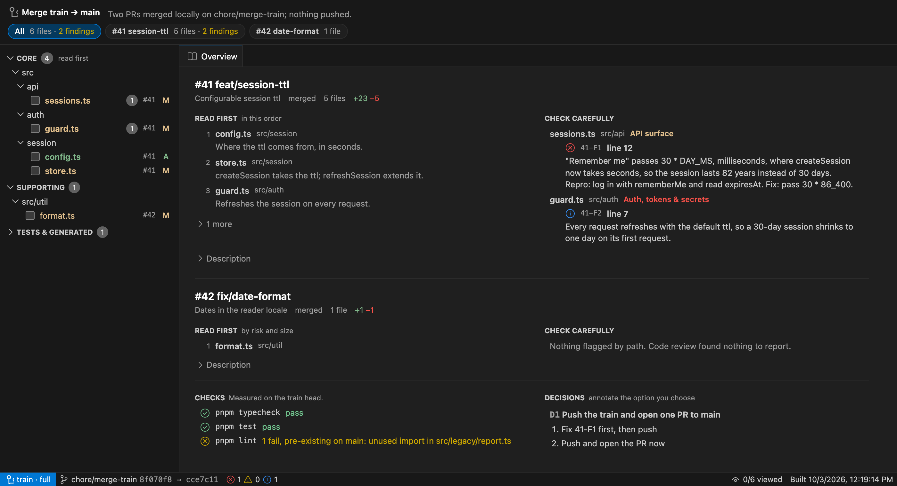
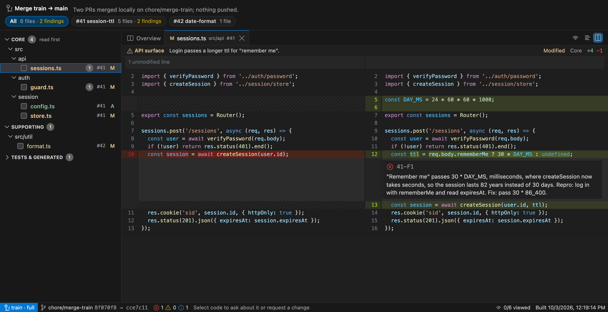

# review-board

[](https://github.com/FerreiraTiagoWebDev/review-board/actions/workflows/ci.yml)
[](LICENSE)

A Claude Code skill that turns a pull request, a branch, or a merge train of several PRs into one review page, styled after VS Code.
Every change set answers two questions: what to read first, and what to check carefully.
Review findings sit on their lines, test results and open decisions sit beside them, and you answer the agent by annotating the page in [Lavish](https://www.npmjs.com/package/lavish-axi).



Click a finding and its diff opens with the finding under the line it is about:



## How it works

1. The agent collects the diffs from git and, for a merge train, merges the PRs locally on a new branch.
2. With `--full` or a train, it runs a code review on each change set and runs the repo's checks.
3. It writes what to read first, what to check and the findings into a JSON file, and a script builds the page from it.
4. You open the page in Lavish and annotate it: fix, accept or defer a finding, ask about selected code, or choose to push.
5. The agent acts on each answer, rebuilds the page, and opens a PR only when you choose to push.

## Install

Pick one.

**Claude Code plugin**, managed for you:

```
/plugin marketplace add FerreiraTiagoWebDev/review-board
/plugin install review-board@review-board
```

**Any agent** (Claude Code, Codex, Cursor and others), as editable files in your project:

```bash
npx skills@latest add FerreiraTiagoWebDev/review-board
```

You need Node 22 or newer, git, and the GitHub CLI (`gh`) signed in when reviewing PRs.
The page opens in [Lavish](https://www.npmjs.com/package/lavish-axi), which the skill runs through `npx`.

## Use

```
/review-board 1249            # one PR
/review-board feat/x          # a branch against origin/HEAD
/review-board a..b            # a git range
/review-board                 # the current branch plus uncommitted work
/review-board 1243 1246 1247  # a merge train of three PRs
/review-board 1249 --full     # add code review and the repo's checks to a single PR
/review-board 1249 --restyle  # match the page to your project's design tokens
```

Installed as a plugin, the command is `/review-board:review-board`.

The skill never merges into your main branches and never pushes unless you choose to on the page.

## What ends up in your project

The first run creates a `reviews/` folder:

```
reviews/
├── skeleton.html          # the page template; commit it, edit it to restyle every review
├── pr-1249.review.json    # the review's data
└── pr-1249.html           # the page you open
```

Pages and data files carry full diffs, so the skill adds them to `.gitignore`.
Only the template is meant to be committed.

## Update

Plugin: `/plugin` → Installed → review-board → Update, or `claude plugin update review-board@review-board`.
Third-party plugins do not update on their own unless you turn on auto-update for the marketplace in `/plugin`.

skills.sh: `npx skills@latest update review-board`.

## Development

```bash
pnpm install
pnpm check        # lint, types, unit and integration tests, plugin manifest, browser tests
pnpm screenshots  # rebuild the README images from a demo repo
```

The skill itself is `skills/review-board/` and has no dependencies; everything else in the repo is tooling and tests.
Browser tests replay a recorded copy of the diff renderer from esm.sh, recorded on the first run; `LIVE_CDN=1 pnpm test:e2e` checks the real CDN.

## License

MIT.
Icons are [Codicons](https://github.com/microsoft/vscode-codicons) by Microsoft, CC BY 4.0.
